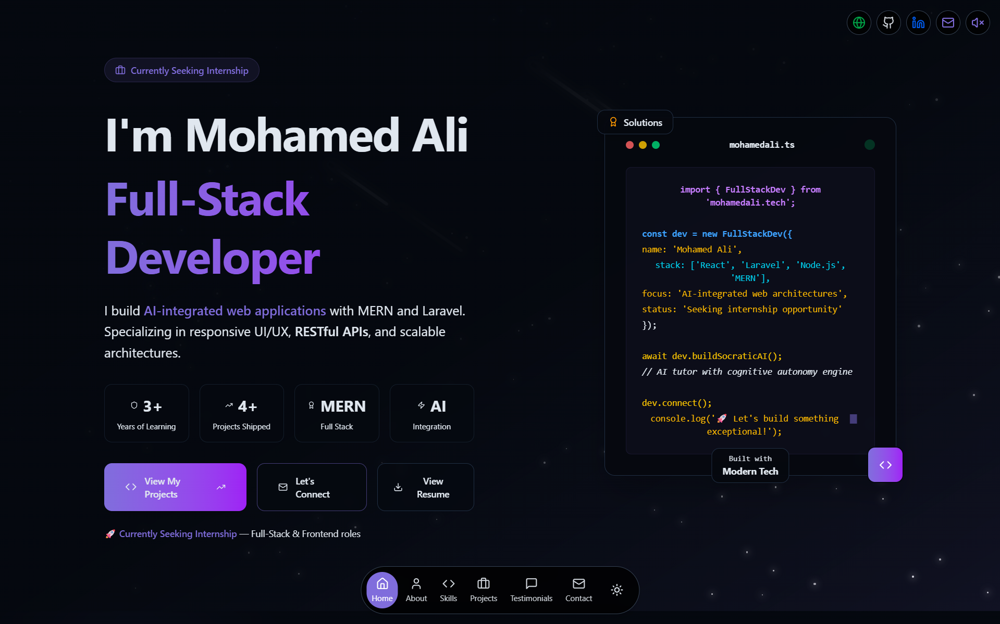
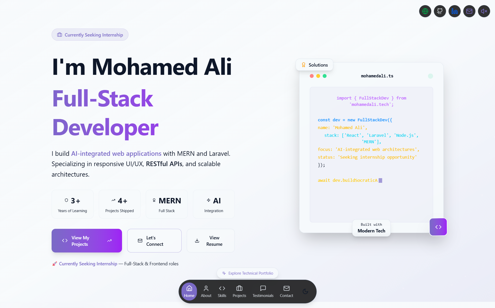
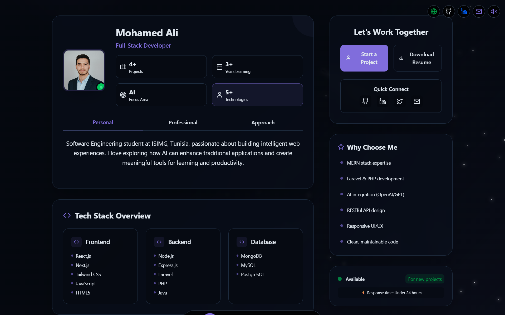
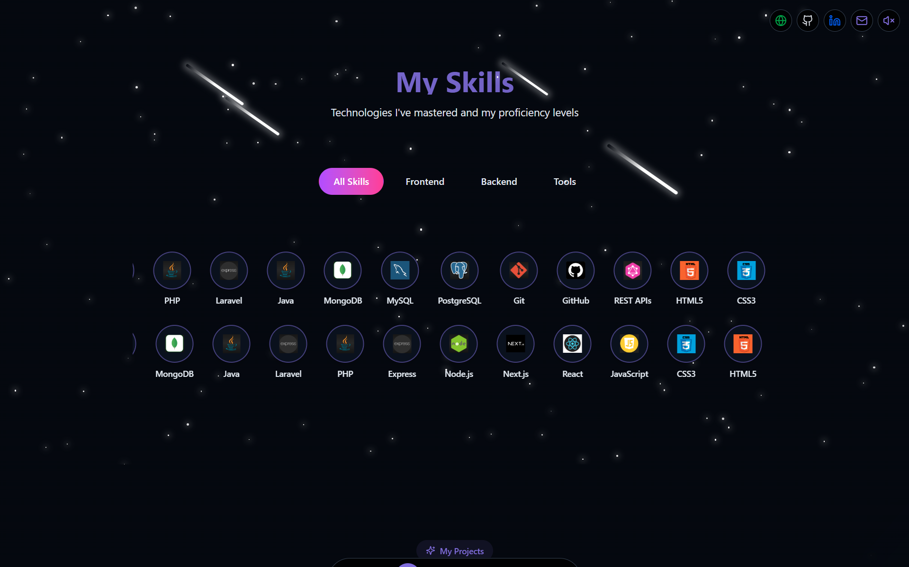
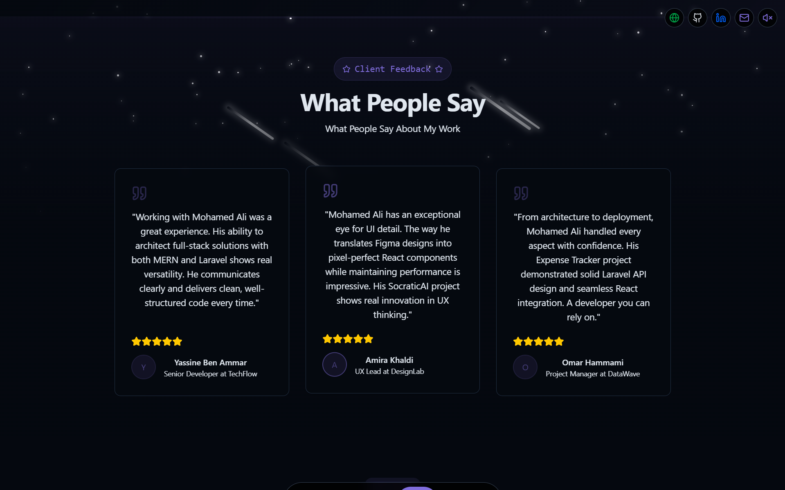
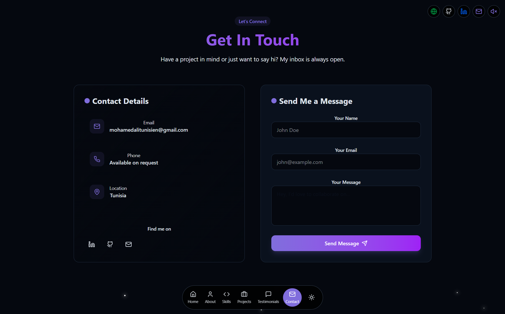

# 💼 Mohamed Ali — Full-Stack Developer Portfolio

A fast, modern, and responsive developer portfolio built with **React**, **Vite**, **Tailwind CSS**, and **Framer Motion**. Designed to showcase projects, skills, and contact information with a bold, ambitious dark-themed aesthetic.

🌐 **Live:** [mohamedali.tech](https://mohamedali.tech)

## 🚀 Tech Stack

- ⚛️ React 18 (with Vite for fast dev/build)
- 💨 Tailwind CSS v4 (utility-first styling)
- 🎭 Framer Motion (smooth animations & transitions)
- 🌙 next-themes (dark/light mode toggle)
- 🧭 React Router v7 (client-side routing)
- 🎨 Lucide React (icon system)

## 📸 Screenshots

### 🏠 Home Page  



### 🧰 Other Sections  





## ✨ Features

- 🌑 Dark theme by default with light mode toggle
- 📱 Fully responsive and mobile-friendly
- 🎬 Animated welcome screen with typing effect
- 💻 Interactive code snippet in hero section
- 🧩 Filterable skills with infinite scroll
- 🗂️ Project cards with category filtering & video modals
- ⭐ Testimonials carousel
- 📬 Contact form (Formspree integration)
- 🎵 Background music player
- 🔍 Full SEO optimization (meta tags, OG, structured data)

## 🛠️ Getting Started

1. **Clone the repository**
   ```bash
   git clone https://github.com/MohamedAliCH/main-portfolio.git
   cd main-portfolio
   ```

2. **Install dependencies**
   ```bash
   cd client
   npm install
   ```

3. **Run the development server**
   ```bash
   npm run dev
   ```

4. **Customize your content**
   - Update components in `client/src/components/` for section content
   - Add your profile photo to `client/public/profile-photo.png`
   - Add your resume to `client/public/MohamedAli-resume.pdf`
   - Add project screenshots to `client/public/projects/`

## 🏗️ Build for Production

```bash
npm run build
```

## 📤 Deploying

You can deploy the site using platforms like:

- [Vercel](https://vercel.com/)
- [Netlify](https://www.netlify.com/)
- [GitHub Pages](https://pages.github.com/) (with additional config)

## 📂 Project Structure

```
client/
├── public/              # Static assets (images, resume, etc.)
├── src/
│   ├── components/      # All section components
│   │   ├── HeroSection.jsx
│   │   ├── AboutSection.jsx
│   │   ├── SkillsSection.jsx
│   │   ├── ProjectsSection.jsx
│   │   ├── Testimonial.jsx
│   │   ├── ContactSection.jsx
│   │   ├── Navbar.jsx
│   │   ├── Footer.jsx
│   │   └── WelcomeScreen.jsx
│   ├── pages/           # Page layouts
│   ├── App.jsx          # Root component
│   ├── main.jsx         # Entry point
│   └── index.css        # Global styles & design tokens
└── index.html           # HTML template with SEO meta tags
```

## 📬 Contact

- 🌐 Website: [mohamedali.tech](https://mohamedali.tech)
- 💼 LinkedIn: [Mohamed Ali Chouchane Hmila](https://www.linkedin.com/in/mohamed-ali-chouchane-hmila-511ba8371)
- 🐙 GitHub: [MohamedAliCH](https://github.com/MohamedAliCH)
- 📧 Email: mohamedalitunisien@gmail.com

---

**Made with ❤️ by Mohamed Ali using React, Vite & Tailwind CSS**
